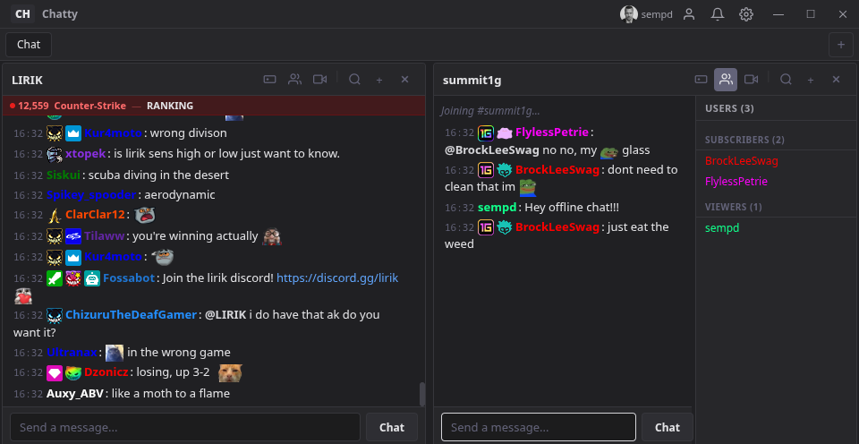
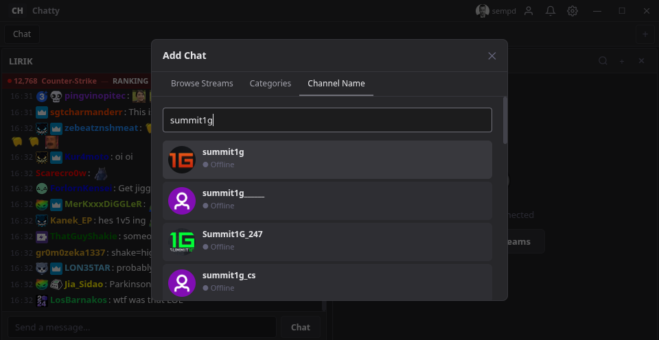
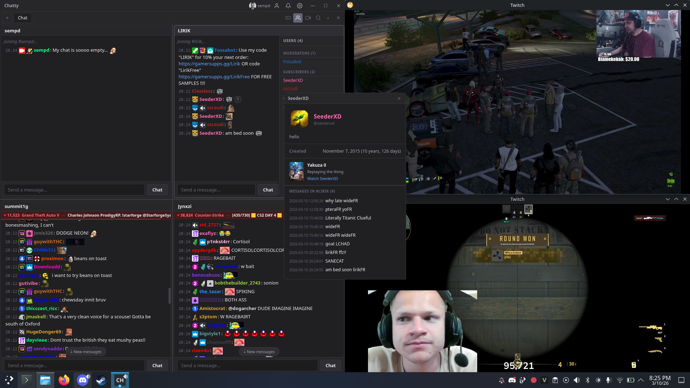

# Chatty

**A modern Twitch chat client for desktop — inspired by Chatterino.**

Chatty is a lightweight, multi-pane Twitch chat client built with Electron. Connect to multiple channels simultaneously, view emotes from all major providers, moderate chat, and more — all from a single, sleek interface.


---

## Screenshots

### Multi-Pane Split Chat
View multiple Twitch channels side-by-side with full emote and badge rendering, live stream info, and an inline user list — all in one window.



### Channel Search
Quickly find and join any Twitch channel by name, browse top live streams, or explore categories.



### All-In-One Streaming Setup
Replace a dozen browser tabs and apps with one lightweight desktop client — chat, stream info, profile cards, and video all in a single window alongside your other tools.



---

## Features

### Multi-Pane Chat
- Open multiple Twitch channels side-by-side in split panels
- Drag and drop panels to rearrange — snap horizontally or vertically
- Tabbed layout for organizing different channel groups
- Resize panels freely with drag gutters

### Full Emote Support
- **Twitch** native emotes rendered from the official CDN
- **BetterTTV** (BTTV) global and channel emotes
- **FrankerFaceZ** (FFZ) global and channel emotes
- **7TV** global and channel emotes
- Emotes scale cleanly with your chosen font size

### Twitch Badge Rendering
- Full badge images for subscribers, moderators, VIPs, broadcasters, Twitch Prime, and more
- Channel-specific badges (custom sub badges, bits badges)
- Badges shown in both chat messages and the viewer list

### Profile Cards
- Click any username to open a floating, draggable profile card
- Shows avatar, display name, bio, account creation date
- Follow/subscribe status (when you have moderator rights)
- Last streamed game with clickable category box art
- Scrollable message history with live updates and emote rendering
- Moderation buttons (timeout, ban) for moderators

### Viewer List
- Inline sidebar showing all chatters in a channel
- Categorized by role: Broadcaster, Moderators, VIPs, Subscribers, Viewers
- Badge icons next to each username
- Click any user to view their profile card

### Stream Info
- Live viewer count, game/category, and stream title
- Popout video player for any channel
- Clickable channel names and category links

### Moderation Tools
- Timeout and ban users directly from profile cards
- Delete individual messages (moderator rights required)
- Uses the Twitch Helix API for reliable moderation actions

### Chat Features
- Clickable links in chat messages
- @mention highlighting
- Chat logging to local files
- Hoverable messages with visible background
- New message indicator when scrolled up
- Auto-scroll with smart pause on scroll-up

### Alerts (EventSub)
- Real-time alerts for follows, subscriptions, cheers, and raids
- Powered by Twitch EventSub WebSocket

### Customization
- Dark/gray modern theme
- Adjustable font size via settings (live preview slider)
- Toggle timestamps on/off
- Configurable max message history
- Resizable panels and sidebars

---

## Installation

Download the latest release for your platform from the [Releases](https://github.com/KevinEightSeven/Chatty/releases) page:

| Platform | Download |
|----------|----------|
| Windows  | `Chatty-Setup.exe` |
| macOS    | `Chatty.dmg` |
| Linux    | `Chatty.AppImage` |

### Linux
```bash
chmod +x Chatty-*.AppImage
./Chatty-*.AppImage
```

---

## Build from Source

### Prerequisites
- [Node.js](https://nodejs.org/) 18+
- npm

### Setup
```bash
git clone https://github.com/KevinEightSeven/Chatty.git
cd Chatty
npm install
```

### Run in Development
```bash
npm start

# With DevTools
npm run dev
```

### Build Installers
```bash
# All platforms
npm run dist

# Platform-specific
npm run dist:win
npm run dist:mac
npm run dist:linux
```

---

## Tech Stack

- **Electron** — Cross-platform desktop framework
- **Twitch Helix API** — User data, channel info, moderation, chat messaging
- **Twitch IRC (WebSocket)** — Real-time chat messages
- **Twitch EventSub** — Live alerts and notifications
- **BTTV / FFZ / 7TV APIs** — Third-party emote providers
- **electron-store** — Persistent settings and session state

---

## License

MIT License — see [LICENSE](LICENSE) for details.
